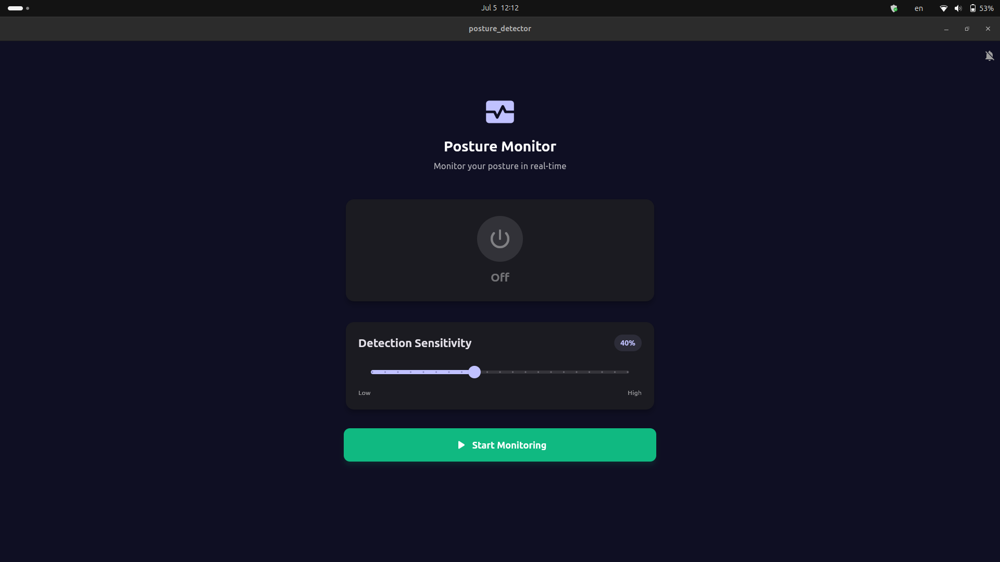
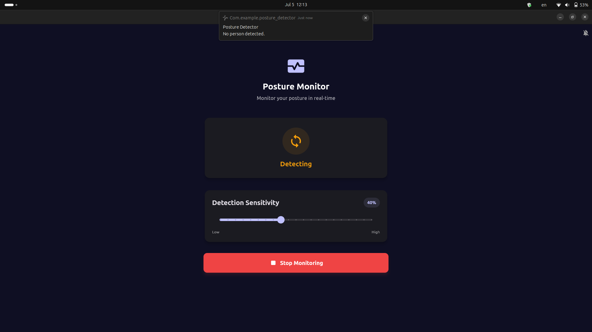
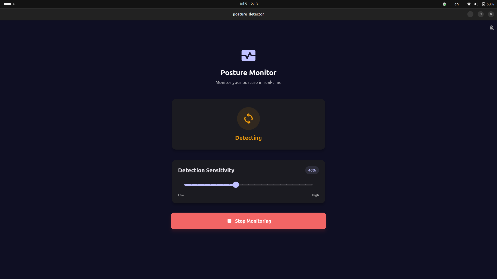
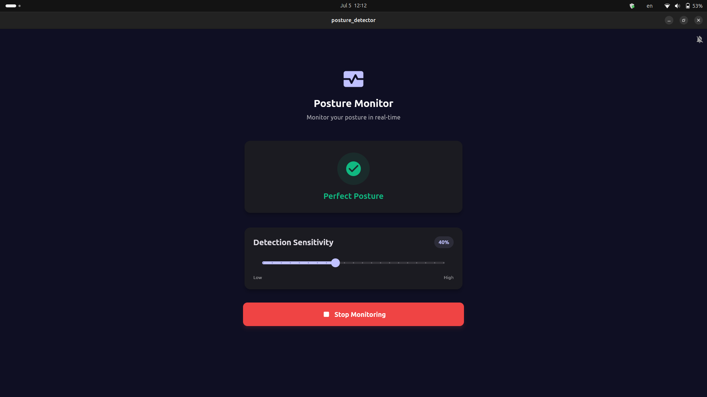

# Posture Detector

A cross-platform desktop application for real-time posture monitoring using your device’s camera. Built with Flutter and Riverpod, Posture Detector helps users maintain healthy posture habits by providing instant feedback and notifications.

## Table of Contents
- [Features](#features)
- [Installation](#installation)
- [Usage](#usage)
- [App Screenshots](#app-screenshots)
- [Project Structure](#project-structure)
- [Dependencies](#dependencies)

## Features
- Real-time posture detection (upright, leaning, unresolved)
- Adjustable detection sensitivity
- Sound and system notifications
- Modern, responsive UI

## Installation

### Prerequisites
- [Flutter SDK](https://docs.flutter.dev/get-started/install) (>=3.8.1)
- Desktop platform support (Windows, Linux)

### Steps
1. Clone this repository:
   ```bash
   git clone https://github.com/Hendawy44165/posture_detector.git
   cd posture_detector
   ```
2. Install dependencies:
   ```bash
   flutter pub get
   ```
3. Run the venv setup script (choose the command for your OS):
   - **Linux:**
     ```bash
     cd scripts
     ./venv_setup_linux.sh
     cd ..
     ```
   - **Windows (Command Prompt):**
     ```bat
     cd scripts
     venv_setup_windows.bat
     cd ..
     ```
4. Run the app:
   ```bash
   flutter run -d <windows | linux> --release
   ```

## Usage
- Launch the app and allow camera access if prompted.
- Click **Start Monitoring** to begin posture detection.
- Adjust sensitivity using the slider.
- Enable/disable sound notifications as needed.

## App Screenshots

Below are screenshots demonstrating the main states and workflow of the Posture Monitor app:

| Off State | Detecting (No Person Detected) |
|---|---|
|  |  |

| Detecting | Poor Posture Detected |
|---|---|
|  |  |

| Perfect Posture Detected |
|---|
|  |

Each screenshot represents a different state:
- **Off State:** Monitoring is stopped.
- **Detecting (No Person Detected):** No person is visible to the camera.
- **Detecting:** The app is analyzing posture.
- **Poor Posture Detected:** The app detected poor posture.
- **Perfect Posture Detected:** The app detected perfect posture.

## Project Structure

```
posture_detector/
├── lib/
│   ├── main.dart                   # Application entry point and root widget
│   ├── models/
│   │   └── posture_models.dart     # Data models for posture results, errors, and status
│   ├── providers/
│   │   └── posture_monitor_provider.dart # State management logic (Riverpod)
│   ├── services/
│   │   ├── background_process_service.dart # Handles posture detection subprocess
│   │   ├── notification_service.dart      # Local notification abstraction
│   │   └── sound_pref_service.dart        # Sound preference persistence
│   ├── components/
│   │   ├── enums/
│   │   │   ├── error_messages.dart   # Error categories and user-friendly messages
│   │   │   └── posture_state.dart    # Posture state enum and helpers
│   │   ├── theme/
│   │   │   └── app_theme.dart        # App-wide theme and style constants
│   │   └── widgets/
│   │       ├── control_button.dart   # Start/stop monitoring button widget
│   │       ├── header.dart           # App header widget
│   │       ├── sensitivity_card.dart # Sensitivity adjustment UI
│   │       └── status_card.dart      # Posture status display
│   └── ...
├── assets/                          # App assets (images, icons, etc.)
├── scripts/                         # Python background script process
├── pubspec.yaml                     # Flutter dependencies and metadata
└── README.md                        # Project documentation
```

## Dependencies
Key packages:
- `flutter_riverpod` – State management
- `window_manager` – Window controls for desktop
- `flutter_local_notifications` – Cross-platform notifications
- `shared_preferences` – Local storage for user preferences

See [`pubspec.yaml`](pubspec.yaml) for the complete list.

